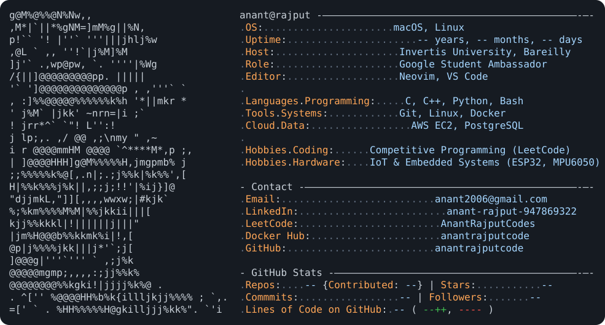

<h1 align="center">Hi 👋, I'm Anant</h1>
<h3 align="center">B.Tech Computer Science student | Building with C/C++, Python, IoT & the Cloud</h3>

  Motivated CS student with strong foundations in C, C++, Python, and Object-Oriented Programming.
  Led a team building an IoT-based gesture-controlled car, and currently serve as a Google Student
  Ambassador. Familiar with Git, Linux, Docker, and basic cloud infrastructure (AWS EC2) — always
  building and always learning.

---

### 🚀 Currently

- 🎓 Pursuing **B.Tech in Computer Science** at Invertis University, Bareilly (Expected 2029)
- 🌱 Representing Google on campus as a **Google Student Ambassador**
- 🔭 Building practical projects across IoT, DevOps, and cloud infrastructure
- 👯 Led a team designing and building an **IoT-based gesture-controlled RC car**

### 🛠️ Skills

**Programming:**    

**Systems & Tools:**   

**Cloud & Data:**  

**IoT & Hardware:** ESP32 / ESP8266 &nbsp;•&nbsp; Sensor Integration (MPU6050) &nbsp;•&nbsp; Wireless Communication

**Software:** MS Office &nbsp;•&nbsp; Octave / MATLAB

### 📌 Featured Projects

- 🤖 **[Hand Gesture Controlled RC Car](#)** — A glove-based controller using an MPU6050 accelerometer/gyroscope to translate hand movements into real-time car control, via ESP32/ESP8266 wireless communication. Led the team through design, assembly, and testing.
- ☁️ **[EC2Connect](https://github.com/anantrajputcode/ec2connect)** — Bash scripts that simplify connecting to AWS EC2 instances over SSH: just provide a key name and instance IP/DNS, and it builds and runs the SSH command automatically.
- 🐳 **[Docker Containerization](https://github.com/anantrajputcode/Docker-Containerization)** — Containerized an existing website with a custom Dockerfile, then built and pushed the image to Docker Hub for pull-and-run deployment.

### 📊 GitHub Stats

  <picture>
    <source media="(prefers-color-scheme: dark)" srcset="dark_mode.svg">
    <source media="(prefers-color-scheme: light)" srcset="light_mode.svg">
    
  </picture>

This card updates automatically once a day via GitHub Actions — see <code>today.py</code>.

### 🌐 Connect with me

  
  
  
  

